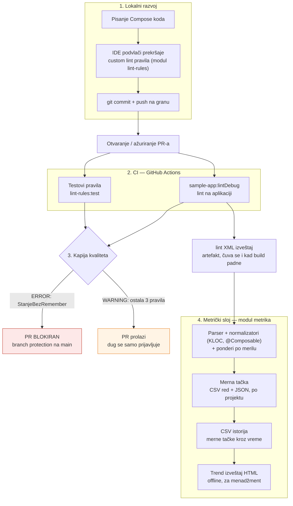

# Arhitektura okvira za statičku analizu Compose koda

Ovaj dokument prikazuje ceo sistem od pisanja koda do izveštaja za menadžment.
Dijagram je u Mermaid formatu (renderuje se na GitHubu i lako se pretače u sliku
za rad); ispod njega je opis svakog koraka punim rečenicama.

## Dijagram toka

## Opis koraka

### 1. Lokalni razvoj (IDE)

Programer piše Compose kod u Android Studiju. Custom lint pravila iz modula
`lint-rules` vezana su za aplikaciju kroz `lintChecks(project(":lint-rules"))`,
pa IDE podvlači prekršaje uživo — crvenom linijom za greške (nivo `error`) i
žutom za upozorenja. Povratna sprega je trenutna: prekršaj se vidi pre komita,
što je najjeftinije mesto da se dug uhvati.

### 2. CI — GitHub Actions

Na svaki push/PR pokreće se `.github/workflows/lint.yml`, koji radi dve stvari:
pušta **testove samih pravila** (`:lint-rules:test`) da bi se osiguralo da pravila
i dalje rade kako je specifikovano, i pušta **lint nad aplikacijom**
(`:sample-app:lintDebug`). Izveštaji se čuvaju kao artefakti čak i kad build
padne (`if: always()`), da bi se nalazi mogli pregledati.

### 3. Kapija kvaliteta (politika primene)

Rezultat lint-a prolazi kroz kapiju čija je politika izvedena iz jednog načela
(ozbiljnost prati pouzdanost detekcije, videti `docs/politika-primene.md`):
prekršaj nivoa **ERROR** (`StanjeBezRemember` — korektnost, pouzdana detekcija)
obara build i, uz branch protection na `main`, **blokira PR**; prekršaji nivoa
**WARNING** (ostala tri pravila) se samo prijavljuju i ne blokiraju spajanje.
Pri uvođenju u živ projekat koristi se baseline: zatečeni dug se prihvata, a
samo novi prekršaji obaraju kapiju.

### 4. Metrički sloj (modul `metrika`)

lint XML izveštaj (artefakt iz koraka 2) ulazi u modul `metrika`. Parser izdvaja
naša 4 nalaza (tuđa broji kao kontekst), normalizatori mere veličinu koda
(KLOC i broj `@Composable`), a ponderi po merilu (UTICAJ × POUZDANOST) daju
ponderisani zbir duga. Rezultat je jedna **merna tačka** (jedan CSV red + JSON),
vezana za projekat i komit. Merne tačke se dopisuju u **CSV istoriju**, iz koje
se generiše **trend izveštaj** (samostalan HTML, radi offline iz CI artefakta),
namenjen menadžmentu — sa razbijanjem po pravilu i po projektu.

## Granice i tok podataka

- **Jednosmeran tok:** kod → nalaz → metrika → izveštaj; metrički sloj ne menja
  kod niti pravila, samo meri.
- **Bez baze:** istorija je jedan CSV fajl (dopisivanje), što je dovoljno za
  trend i trivijalno za CI artefakt.
- **Razdvojene odgovornosti:** `lint-rules` (detekcija), `sample-app` (poligon),
  `metrika` (merenje i izveštavanje) su nezavisni Gradle moduli.
